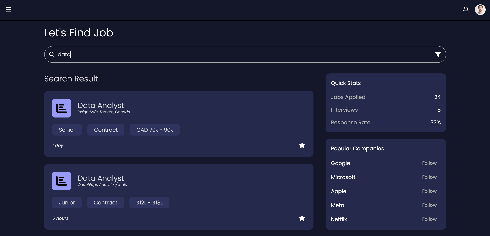
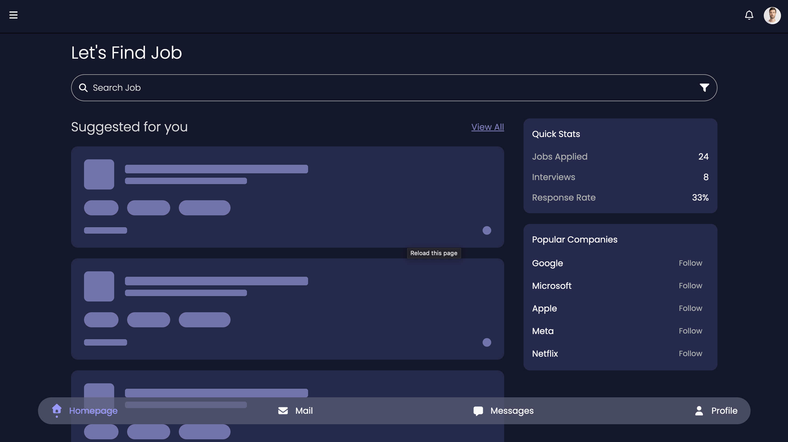
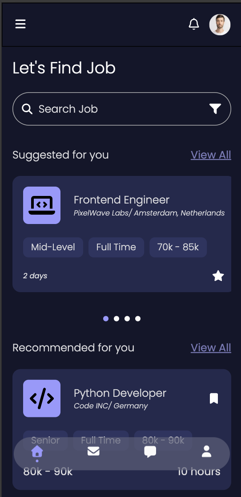
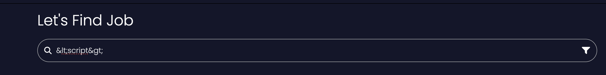
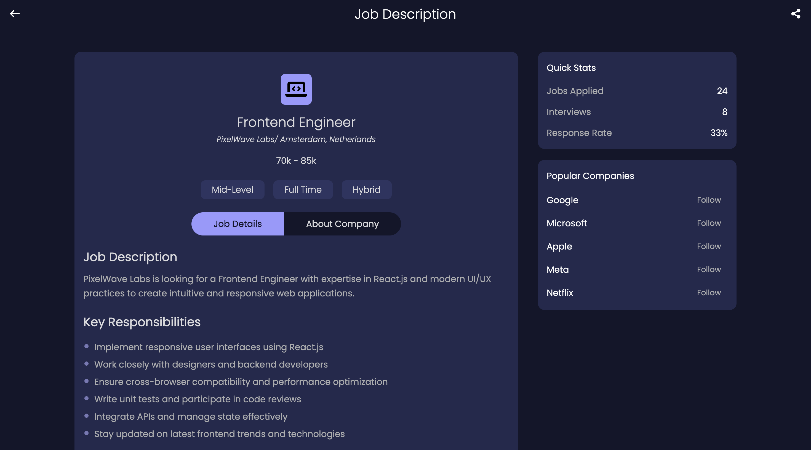
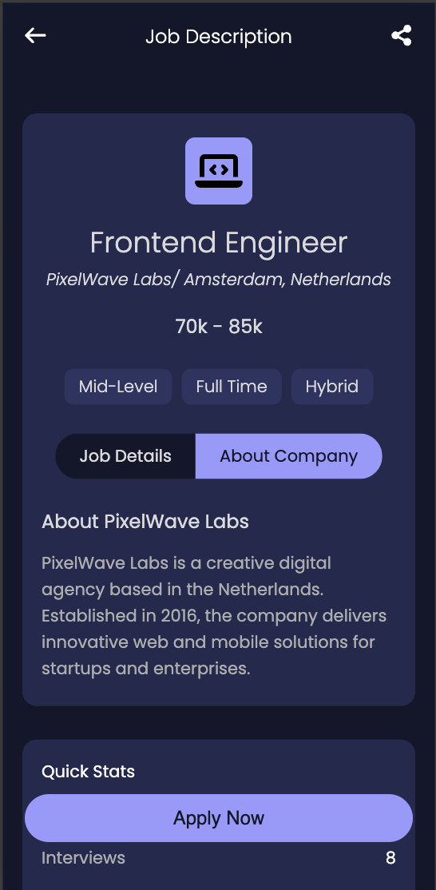
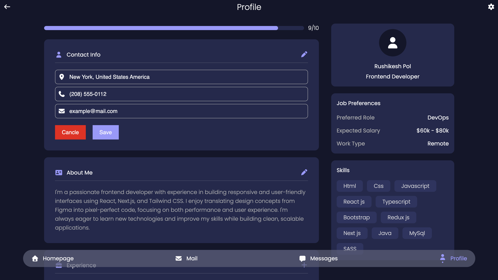
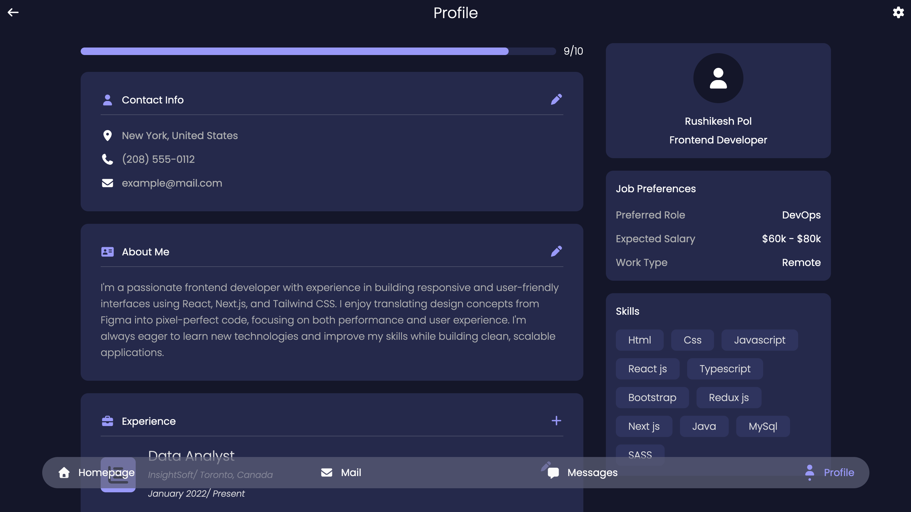
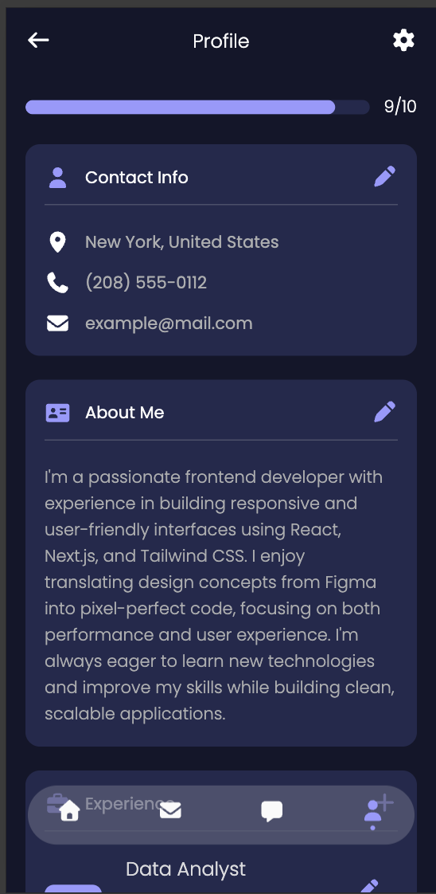

# Amonex Assessment – Job Portal UI

This project showcases a fully responsive **Homepage**, **Job Details Page**, and **User Profile Page** built using modern frontend technologies like **React**, **Tailwind CSS**, and **Vite**.

---

## 🚀 Live Demo

🔗 [Try it here](https://rushikesh-amonex-test.netlify.app/)

---

## 📌 Key Features

- 🔍 Display of **Suggested** and **Recommended** job roles
- 🧭 Manual **Job Search** functionality
- 💨 **Skeleton loaders** for job cards to enhance UX during loading
- 📱 **Mobile-first responsive UI** design
- 🛡️ Prevention of **Cross-Site Scripting (XSS)** attacks through input sanitization

---

## 🛠️ Technologies Used

- ⚛️ React.js
- 🎨 Tailwind CSS
- ⚡ Vite.js

---

## 🖼️ Screenshots & Descriptions

### 🔍 Search Functionality

> This shows the job search bar, allowing users to manually search for jobs with real-time filtering and dynamic updates.

---

### 💨 Skeleton Loaders

> Displays skeleton loading placeholders used while job data is being fetched, improving user experience during load times.

---

### 📱 Responsive Homepage

> The homepage layout adjusts fluidly for different screen sizes, maintaining accessibility and clarity on mobile.

---

### 🛡️ Sanitized Inputs

> Demonstrates how inputs are sanitized to block malicious scripts and protect against XSS attacks.

---

### 🧾 Job Details Page (Desktop)

> Shows a detailed job view including role, location, description, and job type in a structured desktop layout.

---

### 📱 Job Details Page (Mobile)

> The same job details page adapted for mobile devices with clean stacking and spacing for small screens.

---

### 🔄 Dynamic Content Updates

> Showcases how the UI updates dynamically based on user interactions like filtering or navigation.

---

### 👤 User Profile Page (Desktop)

> Displays user profile information such as name, contact, and user details in a clean, accessible format.

---

### 📱 User Profile Page (Mobile)

> Optimized version of the user profile layout for mobile users with better stacking and touch-friendly spacing.

---

## 📂 Project Structure

